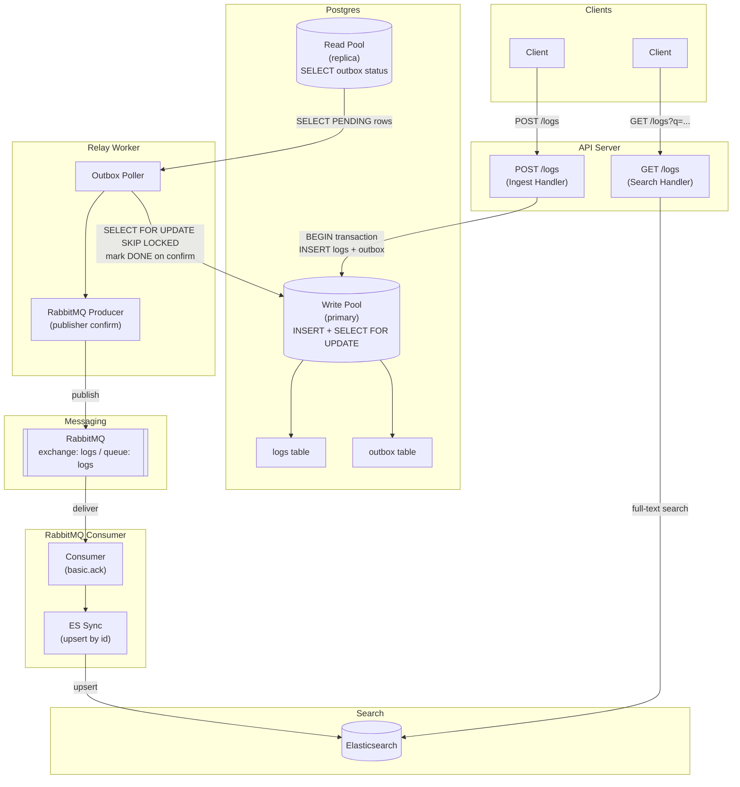

# Logging System

A hands-on exploration of building a production-grade log ingestion and search system using the **Transactional Outbox Pattern** and **CQRS** (Command Query Responsibility Segregation).

---

## Architecture



---

## Components

| Component             | Responsibility                                                                                          |
| --------------------- | ------------------------------------------------------------------------------------------------------- |
| **API Server**        | Handles `POST /logs` (ingest) and `GET /logs` (search)                                                  |
| **Postgres**          | ACID source of truth; holds both `logs` and `outbox` tables                                             |
| **Relay Worker**      | Polls the outbox for `PENDING` rows, publishes to RabbitMQ, marks rows `DONE`                           |
| **RabbitMQ**          | Durable message broker; exchange routes messages to the `logs` queue, decoupling the relay from ES sync |
| **RabbitMQ Consumer** | Reads from the `logs` queue and upserts log documents into Elasticsearch                                |
| **Elasticsearch**     | Full-text search index serving all read queries                                                         |

---

## Data Flow

### Write Path

1. Client sends `POST /logs` to the API Server.
2. API Server opens a Postgres transaction and atomically writes two rows:
   - One row into the `logs` table (the canonical log record).
   - One row into the `outbox` table with `status = PENDING` and the log payload as JSON.
3. Transaction commits. The write is durable regardless of what happens downstream.

### Relay Worker

1. Continuously polls `outbox` WHERE `status = PENDING` using `SELECT FOR UPDATE SKIP LOCKED` (safe for multiple worker replicas).
2. Publishes the payload to the RabbitMQ `logs` exchange and waits for a publisher confirm from the broker.
3. On successful confirm: updates the outbox row to `status = DONE`.
4. On failure: retries with exponential backoff; marks the row `FAILED` after exhausting retries.

### RabbitMQ Consumer (ES Sync Service)

1. Consumes messages from the durable RabbitMQ queue `logs` (bound to the `logs` direct exchange).
2. Upserts the log document into Elasticsearch using the log `id` as the document key (idempotent).
3. Sends `basic.ack` to RabbitMQ only after a successful Elasticsearch write; sends `basic.nack` with `requeue=true` on transient failures (such as Elasticsearch errors); invalid payloads use `basic.nack` with `requeue=false` so the queue cannot be poisoned indefinitely.

### Read Path

1. Client sends `GET /logs?q=<term>&level=<level>&service=<name>` to the API Server.
2. API Server queries Elasticsearch and returns matching log documents.

---

## Database Schema

### `logs` table

| Column         | Type        | Description                                                    |
| -------------- | ----------- | -------------------------------------------------------------- |
| `id`           | UUID PK     | Unique log identifier                                          |
| `level`        | VARCHAR     | Severity: `DEBUG`, `INFO`, `WARN`, `ERROR`, `FATAL`            |
| `message`      | TEXT        | Human-readable log message                                     |
| `service_name` | VARCHAR     | Originating service                                            |
| `timestamp`    | TIMESTAMPTZ | When the event occurred                                        |
| `metadata`     | JSONB       | Arbitrary structured context (stack traces, request IDs, etc.) |
| `created_at`   | TIMESTAMPTZ | Row insertion time                                             |

### `outbox` table

| Column         | Type        | Description                                |
| -------------- | ----------- | ------------------------------------------ |
| `id`           | UUID PK     | Outbox row identifier                      |
| `log_id`       | UUID FK     | References `logs.id`                       |
| `status`       | VARCHAR     | `PENDING`, `DONE`, or `FAILED`             |
| `payload`      | JSONB       | Serialised log document to publish         |
| `created_at`   | TIMESTAMPTZ | When the outbox row was created            |
| `processed_at` | TIMESTAMPTZ | When the row transitioned out of `PENDING` |

---

## Key Design Patterns

### Transactional Outbox Pattern

Writing the log and the outbox row in a single Postgres transaction guarantees **no messages are lost** even if the relay worker crashes. The outbox row remains `PENDING` and will be retried when the worker restarts. This eliminates the dual-write problem (write to DB then publish to RabbitMQ) where a crash between the two steps causes data loss.

### CQRS (Command Query Responsibility Segregation)

Writes go to Postgres (strongly consistent, ACID). Reads go to Elasticsearch (fast full-text search). The two stores are **eventually consistent** by design — Elasticsearch reflects Postgres after the relay and consumer have processed the outbox row.

### At-Least-Once Delivery

- **Producer side**: The relay only marks a row `DONE` after RabbitMQ returns a publisher confirm. A crash before the confirm leaves the row `PENDING` for retry.
- **Consumer side**: The RabbitMQ consumer sends `basic.ack` only after a successful Elasticsearch upsert. On **transient** failures it sends `basic.nack` with `requeue=true`, causing RabbitMQ to redeliver; **invalid** messages are negatively acknowledged without requeue so they are not replayed forever. The upsert is safe to repeat because it is idempotent by log `id`.

### LISTEN/NOTIFY + Fallback Polling

The Relay Worker uses two separate Postgres connections:

1. **Listen connection** (`pgx.Conn`) — dedicated to `LISTEN outbox_ready`. Postgres fires a `pg_notify('outbox_ready', ...)` via trigger on every `INSERT INTO outbox`, which wakes the worker immediately with sub-millisecond latency.
2. **Write pool** (`pgxpool.Pool`) — used exclusively for `SELECT FOR UPDATE SKIP LOCKED` and `UPDATE` operations.

`WaitForNotification` is called with a 30-second timeout. If no notification arrives within the window (e.g., the trigger fired before the worker reconnected after a restart), the timeout fires and acts as a **fallback poll**, ensuring no rows are stuck permanently. This hybrid approach gives the responsiveness of an event-driven system with the reliability of polling.

### No API Gateway

A single API server handles both ingestion and search. There is no need for routing federation, cross-service auth, or rate-limit aggregation at this scope.

---

## Project Structure

This is a Go monorepo. Each service is an independent binary with its own `main.go`.

```
Learn_logging_system/
│
├── docker-compose.yml              # Spins up Postgres, RabbitMQ, Elasticsearch + all services
├── .env.example                    # Shared environment variable template
├── README.md
│
├── services/
│   ├── api-server/                 # HTTP service: POST /logs + GET /logs
│   │   ├── Dockerfile
│   │   ├── go.mod
│   │   ├── main.go
│   │   └── internal/
│   │       ├── handler/
│   │       │   ├── ingest.go       # POST /logs — writes logs + outbox in one transaction
│   │       │   └── search.go       # GET /logs — queries Elasticsearch
│   │       ├── db/
│   │       │   ├── postgres.go     # pgx connection pool
│   │       │   └── queries.go      # SQL for logs + outbox inserts
│   │       ├── elastic/
│   │       │   └── client.go       # Elasticsearch search client
│   │       └── config/
│   │           └── config.go       # Env var loading
│   │
│   ├── relay-worker/               # Outbox processor → RabbitMQ producer
│   │   ├── Dockerfile
│   │   ├── go.mod
│   │   ├── main.go
│   │   └── internal/
│   │       ├── poller/
│   │       │   └── poller.go       # LISTEN/NOTIFY + 30s fallback poll + batch publisher
│   │       ├── producer/
│   │       │   └── rabbitmq.go     # RabbitMQ producer with publisher confirms (amqp091-go)
│   │       ├── db/
│   │       │   ├── postgres.go     # NewWritePool + NewListenConn (dedicated LISTEN connection)
│   │       │   └── queries.go      # FetchPending, MarkDone, MarkFailed
│   │       └── config/
│   │           └── config.go
│   │
│   └── rmq-consumer/               # RabbitMQ consumer → Elasticsearch sync
│       ├── Dockerfile
│       ├── Makefile               # Local / CI entry (e.g. `make build`)
│       ├── go.mod
│       ├── main.go
│       └── internal/
│           ├── consumer/
│           │   └── rabbitmq.go    # RabbitMQ consumer with basic.ack / basic.nack
│           ├── elastic/
│           │   └── sync.go        # Elasticsearch upsert by log id (idempotent)
│           ├── model/
│           │   └── log.go         # Ingest JSON shape (mirrors api-server model)
│           └── config/
│               └── config.go      # RABBITMQ_URL, ELASTICSEARCH_URL
│
├── db/
│   └── migrations/
│       ├── 001_create_logs.up.sql
│       ├── 001_create_logs.down.sql
│       ├── 002_create_outbox.up.sql
│       ├── 002_create_outbox.down.sql
│       ├── 003_outbox_notify_trigger.up.sql
│       └── 003_outbox_notify_trigger.down.sql
│
└── scripts/
    ├── seed.sh                     # Insert sample log rows for local testing
    └── reset.sh                    # Drop and recreate the database
```

### Key Go libraries

| Concern              | Library                                                              |
| -------------------- | -------------------------------------------------------------------- |
| HTTP router          | [`gin`](https://github.com/gin-gonic/gin)                            |
| Postgres client      | [`pgx/v5`](https://github.com/jackc/pgx)                             |
| RabbitMQ client      | [`amqp091-go`](https://github.com/rabbitmq/amqp091-go)               |
| Elasticsearch client | [`go-elasticsearch/v8`](https://github.com/elastic/go-elasticsearch) |
| Config / env         | [`godotenv`](https://github.com/joho/godotenv)                       |

---

## Getting Started

### Prerequisites

- [Docker](https://docs.docker.com/get-docker/) and [Docker Compose](https://docs.docker.com/compose/) v2+
- Copy the env template: `cp .env.example .env`

The stack includes an **`rmq-consumer`** service (see `docker-compose.yml`). It requires **`RABBITMQ_URL`** and **`ELASTICSEARCH_URL`**; `compose` sets these for in-network hosts. For a local binary run, set the same variables (see [`.env.example`](.env.example)).

Path-scoped GitHub Actions workflows live under [`.github/workflows/`](.github/workflows/) (for example `ci_rmq-consumer.yml` runs `make check` when `services/rmq-consumer/` changes).

### Go tests from the repo root

```bash
make test   # run `go test` (with `-race`) in api-server, relay-worker, rmq-consumer
make check # same stack: vet + build + test per service (mirrors CI for those workloads)
```

### Run locally

```bash
# Build the api-server image, run Postgres + Elasticsearch, apply migrations, start all services
docker compose up --build

# Tear down all containers and remove named volumes
docker compose down -v
```

### Seed sample logs (optional)

[`scripts/seed.sh`](scripts/seed.sh) checks **`GET /health`** on the API, then **`POST`**s several example log payloads (mixed levels/services) through the HTTP ingest path so they flow via outbox → relay-worker → RabbitMQ → **rmq-consumer** into Elasticsearch. From the repo root:

```bash
bash scripts/seed.sh
```

Override the API base URL if needed (`API_URL=http://localhost:8080 bash scripts/seed.sh` is equivalent to the default). You can also run **`make -C scripts seed`** (see [`scripts/Makefile`](scripts/Makefile)). After it completes, try the **`curl`** examples printed at the end of the script for **`GET /logs`**.

### Available endpoints (once running)

| Method | Path | Description |
|---|---|---|
| `POST` | `/logs` | Ingest a log entry |
| `GET` | `/logs?q=&level=&service=` | Search logs via Elasticsearch |
| `GET` | `/health` | Ping write + read Postgres pools |

### Example request

```bash
curl -X POST http://localhost:8080/logs \
  -H "Content-Type: application/json" \
  -d '{
    "level": "ERROR",
    "message": "database connection failed",
    "service_name": "auth-service",
    "timestamp": "2026-04-28T00:00:00Z",
    "metadata": {"attempt": 3}
  }'
```

### Services to implement

- [x] API Server (HTTP ingestion + search endpoints)
- [x] Postgres schema migrations
- [x] Docker Compose for local orchestration
- [x] Relay Worker
- [x] RabbitMQ Consumer / ES Sync Service
