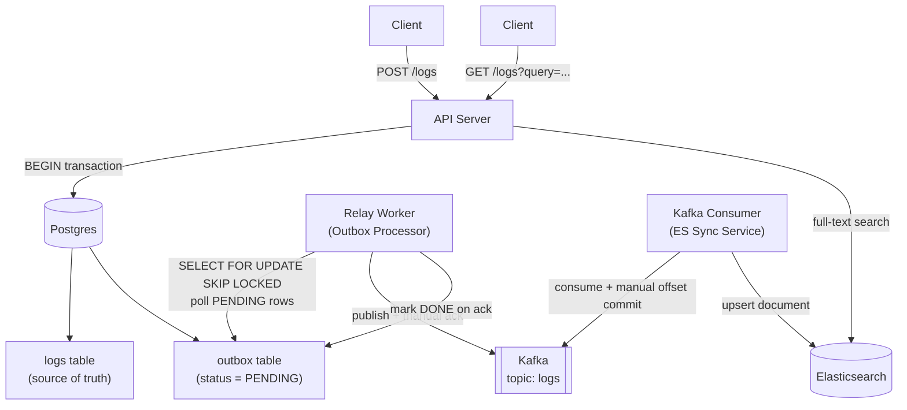

# Logging System

A hands-on exploration of building a production-grade log ingestion and search system using the **Transactional Outbox Pattern** and **CQRS** (Command Query Responsibility Segregation).

---

## Architecture



---

## Components

| Component | Responsibility |
|---|---|
| **API Server** | Handles `POST /logs` (ingest) and `GET /logs` (search) |
| **Postgres** | ACID source of truth; holds both `logs` and `outbox` tables |
| **Relay Worker** | Polls the outbox for `PENDING` rows, publishes to Kafka, marks rows `DONE` |
| **Kafka** | Durable, decoupled message buffer between the relay and ES sync service |
| **Kafka Consumer** | Reads from Kafka and upserts log documents into Elasticsearch |
| **Elasticsearch** | Full-text search index serving all read queries |

---

## Data Flow

### Write Path

1. Client sends `POST /logs` to the API Server.
2. API Server opens a Postgres transaction and atomically writes two rows:
   - One row into the `logs` table (the canonical log record).
   - One row into the `outbox` table with `status = PENDING` and the log payload as JSON.
3. Transaction commits. The write is durable regardless of what happens downstream.

### Relay Worker

1. Continuously polls `outbox` WHERE `status = PENDING` using `SELECT FOR UPDATE SKIP LOCKED` (safe for multiple worker replicas).
2. Publishes the payload to the Kafka topic `logs` and waits for a broker acknowledgement (manual ack).
3. On successful ack: updates the outbox row to `status = DONE`.
4. On failure: retries with exponential backoff; marks the row `FAILED` after exhausting retries.

### Kafka Consumer (ES Sync Service)

1. Reads messages from the Kafka topic `logs`.
2. Upserts the log document into Elasticsearch using the log `id` as the document key (idempotent).
3. Commits the Kafka offset only after a successful Elasticsearch write (manual offset commit).

### Read Path

1. Client sends `GET /logs?query=<term>&level=<level>&service=<name>` to the API Server.
2. API Server queries Elasticsearch and returns matching log documents.

---

## Database Schema

### `logs` table

| Column | Type | Description |
|---|---|---|
| `id` | UUID PK | Unique log identifier |
| `level` | VARCHAR | Severity: `DEBUG`, `INFO`, `WARN`, `ERROR`, `FATAL` |
| `message` | TEXT | Human-readable log message |
| `service_name` | VARCHAR | Originating service |
| `timestamp` | TIMESTAMPTZ | When the event occurred |
| `metadata` | JSONB | Arbitrary structured context (stack traces, request IDs, etc.) |
| `created_at` | TIMESTAMPTZ | Row insertion time |

### `outbox` table

| Column | Type | Description |
|---|---|---|
| `id` | UUID PK | Outbox row identifier |
| `log_id` | UUID FK | References `logs.id` |
| `status` | VARCHAR | `PENDING`, `DONE`, or `FAILED` |
| `payload` | JSONB | Serialised log document to publish |
| `created_at` | TIMESTAMPTZ | When the outbox row was created |
| `processed_at` | TIMESTAMPTZ | When the row transitioned out of `PENDING` |

---

## Key Design Patterns

### Transactional Outbox Pattern
Writing the log and the outbox row in a single Postgres transaction guarantees **no messages are lost** even if the relay worker crashes. The outbox row remains `PENDING` and will be retried when the worker restarts. This eliminates the dual-write problem (write to DB then write to Kafka) where a crash between the two steps causes data loss.

### CQRS (Command Query Responsibility Segregation)
Writes go to Postgres (strongly consistent, ACID). Reads go to Elasticsearch (fast full-text search). The two stores are **eventually consistent** by design — Elasticsearch reflects Postgres after the relay and consumer have processed the outbox row.

### At-Least-Once Delivery
- **Producer side**: The relay only marks a row `DONE` after Kafka confirms receipt. A crash before the ack leaves the row `PENDING` for retry.
- **Consumer side**: The Kafka consumer only commits its offset after a successful Elasticsearch upsert. A crash before the commit causes the message to be redelivered and the upsert to run again (safe because upserts are idempotent by `id`).

### No API Gateway
A single API server handles both ingestion and search. There is no need for routing federation, cross-service auth, or rate-limit aggregation at this scope.

---

## Project Structure

This is a Go monorepo. Each service is an independent binary with its own `main.go`.

```
Learn_logging_system/
│
├── docker-compose.yml              # Spins up Postgres, Kafka, Zookeeper, Elasticsearch + all services
├── .env.example                    # Shared environment variable template
├── README.md
│
├── services/
│   ├── api-server/                 # HTTP service: POST /logs + GET /logs
│   │   ├── Dockerfile
│   │   ├── go.mod
│   │   ├── main.go
│   │   └── internal/
│   │       ├── handler/
│   │       │   ├── ingest.go       # POST /logs — writes logs + outbox in one transaction
│   │       │   └── search.go       # GET /logs — queries Elasticsearch
│   │       ├── db/
│   │       │   ├── postgres.go     # pgx connection pool
│   │       │   └── queries.go      # SQL for logs + outbox inserts
│   │       ├── elastic/
│   │       │   └── client.go       # Elasticsearch search client
│   │       └── config/
│   │           └── config.go       # Env var loading
│   │
│   ├── relay-worker/               # Outbox processor → Kafka producer
│   │   ├── Dockerfile
│   │   ├── go.mod
│   │   ├── main.go
│   │   └── internal/
│   │       ├── poller/
│   │       │   └── poller.go       # SELECT FOR UPDATE SKIP LOCKED polling loop
│   │       ├── producer/
│   │       │   └── kafka.go        # Kafka producer with manual ack (confluent-kafka-go)
│   │       └── config/
│   │           └── config.go
│   │
│   └── kafka-consumer/             # Kafka consumer → Elasticsearch sync
│       ├── Dockerfile
│       ├── go.mod
│       ├── main.go
│       └── internal/
│           ├── consumer/
│           │   └── kafka.go        # Kafka consumer with manual offset commit
│           ├── elastic/
│           │   └── sync.go         # Elasticsearch upsert by log id (idempotent)
│           └── config/
│               └── config.go
│
├── db/
│   └── migrations/
│       ├── 001_create_logs.sql
│       └── 002_create_outbox.sql
│
└── scripts/
    ├── seed.sh                     # Insert sample log rows for local testing
    └── reset.sh                    # Drop and recreate the database
```

### Key Go libraries

| Concern | Library |
|---|---|
| HTTP router | [`net/http`](https://pkg.go.dev/net/http) + [`chi`](https://github.com/go-chi/chi) |
| Postgres client | [`pgx/v5`](https://github.com/jackc/pgx) |
| Kafka client | [`confluent-kafka-go`](https://github.com/confluentinc/confluent-kafka-go) |
| Elasticsearch client | [`go-elasticsearch/v8`](https://github.com/elastic/go-elasticsearch) |
| Config / env | [`godotenv`](https://github.com/joho/godotenv) |
| DB migrations | [`golang-migrate`](https://github.com/golang-migrate/migrate) |

---

## Getting Started

> Setup instructions will be added as services are implemented.

Services to implement:
- [ ] API Server (HTTP ingestion + search endpoints)
- [ ] Postgres schema migrations
- [ ] Relay Worker
- [ ] Kafka Consumer / ES Sync Service
- [ ] Docker Compose for local orchestration
